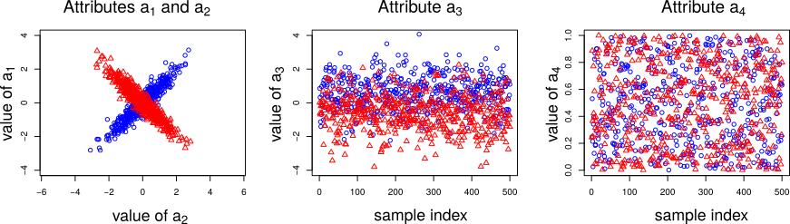

ASTRID
=========

The `astrid` R-package, short for Automatic STRucture IDentification, provides an implementation of the method described in

_Henelius, Andreas, Ukkonen, Antti, and Puolamäki, Kai. Finding Statistically Significant Attribute Interactions. 2016_

The basic idea is to use classifiers to investigate class-dependent attribute interactions in datasets.

Citing
------
To get a BibTex entry in R type `citation("astrid")` when the package is installed.


Installation from GitHub
-----------------------
The development version of the `astrid` package can be installed from GitHub as follows.

First install the `devtools`-package and load it:
```
install.packages("devtools")
library(devtools)
```

You can now install the `astrid` package:
```
install_github("bwrc/astrid-r")
```


Examples
---------
This is a short example demonstrating use of the library.
We here analyse the following synthetic dataset:


The dataset has two classees, each with 500 samples. The data is generated so that attributes a1 and a2 must be used jointly to predict the class (leftmost panel), while attribute a3 carries some (weak) class information (middle panel). Attriubte a4 (rightmost panel) is just noise. The known class-dependent attribute interaction structure is hence given by *((a1, a2), (a3), (a4))*.

```R
## Load the library
library(astrid)
library(e1071)
library(randomForest)

## Create a synthetic dataset with the known
## attribute interaction structure
## ((a1, a2), (a_3), (a_4)), where attribute a_4 is just noise.
dataset <- make_synthetic_dataset(N = 500, seed = 42, mg2 = 0.6)

## Perform the analysis using the ASTRID algorithm
res <- analyze_dataset(dataset, classname = "class",  classifier = "svm", parallel = TRUE, R = 250)

## Print the results as an HTML table
print_result_table_html(res, full_tree = TRUE)
```
This gives the following results for the analysis of the synthetic dataset using the SVM classifier:
<table border=1>
<tr> <th> k </th> <th> acc </th> <th> p </th> <th> a3 </th> <th> a4 </th> <th> a2 </th> <th> a1 </th>  </tr>
  <tr> <td> 2 </td> <td> 0.89 </td> <td> 0.71 </td> <td> (A) </td> <td> (B </td> <td> B </td> <td> B) </td> </tr>
  <tr> <td> 3 </td> <td> 0.88 </td> <td> 0.78 </td> <td> (A) </td> <td> (B) </td> <td> (C </td> <td> C) </td> </tr>
  <tr> <td> 4 </td> <td> 0.73 </td> <td> 0.00 </td> <td> (A) </td> <td> (B) </td> <td> (C) </td> <td> (D) </td> </tr>
   </table>

In this table _k_ is the size (cardinality) of the grouping, _acc_ is the average accuracy of the classifier when trained using a dataset randomised using this grouping, and _p_ is the statistical significance of the grouping. The following columns each denote one attribute (here _a4_, _a3_, _a1_ and _a2_.). At each row, attributes marked with the same letter belong to the same group.

This shows that the maximum-cardinality grouping with a p-value of at least 0.05 is for k = 3, where the grouping is _((a1, a2), (a3), (a4))_. The structure found by the ASTRID algorithm matches the model used to create the data.

License
-------
The `astrid` R-package is licensed under the [MIT-license](http://opensource.org/licenses/MIT).
